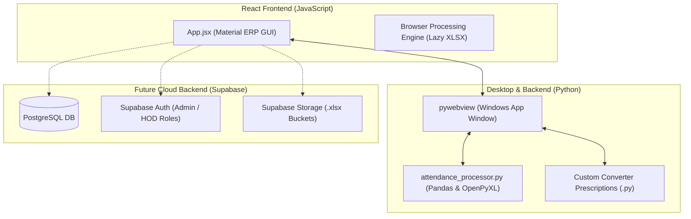
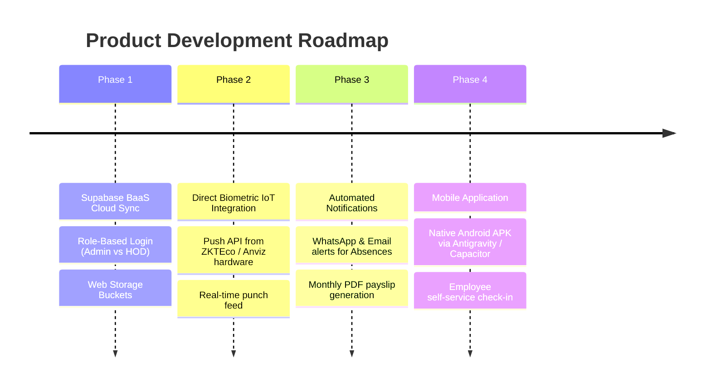

# 📊 Autocrat Attendance — Enterprise Attendance System

A modern, high-performance attendance hub built with **React (Vite), Tailwind CSS, Framer Motion, and Python (`pywebview`)**. Designed for seamless conversion of raw biometric attendance dumps into HR-ready, 5-sheet monthly reports with priority leave deduction and automated anomaly detection.

---

## 📑 Table of Contents
1. [System Overview & Architecture](#-system-overview--architecture)
2. [End-to-End Frontend GUI Walkthrough](#-end-to-end-frontend-gui-walkthrough)
   - [User Flow for Admins vs HODs](#-user-flow-for-admins-vs-hods)
   - [Core UI Components & Interactions](#-core-ui-components--interactions)
3. [Backend Integration Blueprint (Supabase / FastAPI)](#-backend-integration-blueprint)
   - [Why Supabase? (Zero Queries for Users)](#why-supabase-zero-queries-for-users)
   - [Database Schema (PostgreSQL)](#database-schema-postgresql)
   - [Connecting Supabase to Frontend](#connecting-supabase-to-frontend)
4. [Future Scope & Development Roadmap](#-future-scope--development-roadmap)
5. [Local Development & Build Instructions](#-local-development--build-instructions)

---

## 🏗️ System Overview & Architecture

The application uses a **hybrid dual-engine architecture**:



---

## 🎨 End-to-End Frontend GUI Walkthrough

### 👥 User Flow for Admins vs HODs

Neither Admins nor HODs (Heads of Department) write code or queries. The entire application operates via buttons, card selectors, file pickers, modal dialogs, and interactive tables.

| Action / Feature | 👑 Admin / HR View | 👔 HOD (Head of Department) View |
| :--- | :--- | :--- |
| **Excel Input** | Drag-drop or browse raw biometric `.xlsx` files | View processed team attendance for current month |
| **Department Access** | All departments (*All, Engineering, Product, Design, HR*) | Automatically locked to their department (*e.g., Engineering*) |
| **Company Rules** | Configure company week-offs (Sun/Sat), add holidays, set hours | View company holiday calendar and leave policies |
| **Leave Management** | Override/log manual leaves for any employee | Click any team member to log PL/CL/SL leaves via GUI form |
| **Export / Download** | Choose output folder and generate 5-sheet master report | Click 1 button to export department summary `.xlsx` |

---

### 🖥️ Core UI Components & Interactions

#### **1. Quick Access Cards (Top Panel)**
- **Card 1 (Excel Input)**: File upload zone supporting `.xlsx` / `.xls` drag-and-drop. Automatically runs column detection heuristics (`emp_id`, `emp_name`, `date`, `time`).
- **Card 2 (Python Converter)**: Optional custom Python prescription loader (`.py`). Includes an expandable code preview drawer to inspect logic.
- **Card 3 (Output Destination)**: Single combined **Save As...** picker allowing users to choose the target folder and output filename natively.

#### **2. Real-Time Metrics & Charts**
- **4 Key Metric Cards**: Displays Total Employees, Leave Anomalies, Present/Healthy Staff, and Total Working Hours.
- **Attendance Breakdown Bar**: Visual percentage breakdown of Present (P), Half Day (HD), Absent (A), Week Off (WO), and Holidays (H).

#### **3. Interactive Matrix & Department Filters**
- **Tab Navigation**: Switch between **Daily Matrix**, **📋 Leave Details**, and **Summary Stats**.
- **Employee Card Modal**: Clicking any employee row opens a detailed profile showing:
  - Attendance % gauge
  - Priority Leave Deduction rule summary (**PL → CL → SL → LWP**)
  - Leave balance progress bars (**PL: 12 Left**, **CL: 10 Left**, **SL: 8 Left**)
  - Interactive **Log New Leave Entry** GUI form.

---

## ⚡ Backend Integration Blueprint

### Why Supabase? (Zero Queries for Users)
Using **Supabase** (Open-Source Firebase alternative based on PostgreSQL) allows you to attach a cloud backend without writing a separate server from scratch:
1. **Zero SQL Required**: Users use the React GUI, while admins can manage database tables directly via Supabase's visual web dashboard (like Excel).
2. **Instant Auth**: Built-in login system for Admins and HODs.
3. **File Storage**: Dedicated buckets for uploaded `.xlsx` files and exported reports.

---

### Database Schema (PostgreSQL)

If attaching Supabase or a custom SQL backend, use this database structure:

```sql
-- 1. Employees Table
CREATE TABLE employees (
    emp_id VARCHAR(50) PRIMARY KEY,
    emp_name VARCHAR(100) NOT NULL,
    department VARCHAR(50) NOT NULL,
    email VARCHAR(100),
    created_at TIMESTAMP WITH TIME ZONE DEFAULT TIMEZONE('utc', NOW())
);

-- 2. Daily Attendance Logs
CREATE TABLE attendance_logs (
    id BIGSERIAL PRIMARY KEY,
    emp_id VARCHAR(50) REFERENCES employees(emp_id),
    date DATE NOT NULL,
    status VARCHAR(10) NOT NULL, -- P, A, HD, WO, H, PL, CL, SL
    in_time TIME,
    out_time TIME,
    total_hours NUMERIC(4, 2),
    UNIQUE(emp_id, date)
);

-- 3. Leave Balances & Deductions
CREATE TABLE leave_records (
    id BIGSERIAL PRIMARY KEY,
    emp_id VARCHAR(50) REFERENCES employees(emp_id),
    leave_type VARCHAR(10) NOT NULL, -- PL, CL, SL, LWP
    leave_value NUMERIC(3, 2) NOT NULL, -- 1.0, 0.5, 0.25
    start_date DATE NOT NULL,
    end_date DATE NOT NULL,
    created_at TIMESTAMP WITH TIME ZONE DEFAULT TIMEZONE('utc', NOW())
);

-- 4. Company Configuration
CREATE TABLE company_config (
    id INT PRIMARY KEY DEFAULT 1,
    company_name VARCHAR(100) DEFAULT 'Autocrat Solutions',
    working_hours NUMERIC(3,1) DEFAULT 4.0,
    full_day_hours NUMERIC(3,1) DEFAULT 8.0,
    weekoff INT[] DEFAULT '{0}', -- 0 = Sunday
    holidays DATE[] DEFAULT '{}'
);
```

---

### Connecting Supabase to Frontend

#### **1. Install Client**
```bash
cd frontend
npm install @supabase/supabase-js
```

#### **2. Initialize Client (`frontend/src/supabaseClient.js`)**
```javascript
import { createClient } from '@supabase/supabase-js'

const supabaseUrl = import.meta.env.VITE_SUPABASE_URL
const supabaseAnonKey = import.meta.env.VITE_SUPABASE_ANON_KEY

export const supabase = createClient(supabaseUrl, supabaseAnonKey)
```

#### **3. Fetching Attendance in React (`App.jsx`)**
```javascript
import { supabase } from './supabaseClient'

// Fetch team attendance for HOD's department
const fetchDepartmentAttendance = async (departmentName) => {
  const { data, error } = await supabase
    .from('attendance_logs')
    .select('*, employees!inner(emp_name, department)')
    .eq('employees.department', departmentName)
  
  if (error) console.error("Error loading department attendance:", error)
  return data
}
```

---

## 🚀 Future Scope & Development Roadmap



### **Phase 1: Cloud Backend & Multi-tenant Portal (Supabase)**
- Multi-user authentication with Role-Based Access Control (RBAC).
- Cloud sync between desktop `.exe` instances and web portals.
- Historical monthly archives with version control.

### **Phase 2: Direct Biometric IoT Device Integration**
- Connect directly to physical biometric hardware (ZKTEco, Realtime, Anviz) via WebSockets / TCP IP.
- Eliminate manual Excel file uploads by automatically pulling real-time punch logs.

### **Phase 3: Automated Absence Alerts & Notifications**
- Automatic WhatsApp / Email alerts sent to employees when flagged as Absent or Late.
- One-click PDF salary/attendance statement generation.

### **Phase 4: Mobile App (Android APK via Antigravity / Capacitor)**
- Native mobile app deployment using Antigravity build system.
- Geo-fenced mobile attendance check-in for field employees.

---

## 💻 Local Development & Build Instructions

### **1. Run Frontend Development Server**
```bash
cd frontend
npm install
npm run dev
```
Open [http://localhost:5173](http://localhost:5173) in your browser.

### **2. Run Desktop App (Python + pywebview)**
```bash
# Install Python requirements
pip install -r requirements.txt

# Build frontend & start desktop wrapper
npm run build --prefix frontend
python app.py
```

### **3. Package Windows Executable (`.exe`)**
```bash
python build.py
```
Output will be generated in `dist/AutocratAttendance/`.

---

*Autocrat Solutions — Enterprise Attendance Management System*
